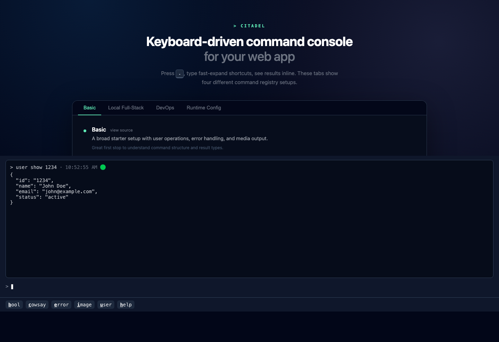
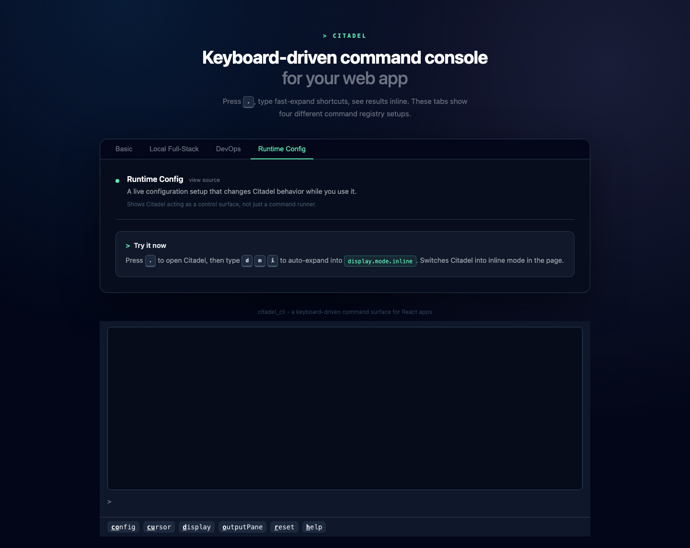

# Embedding Citadel and choosing a display mode

Citadel supports two display modes:

- `panel`: a hidden overlay that opens from the keyboard
- `inline`: an always-visible terminal surface rendered in your layout

You can also toggle whether the output pane is shown.

## Panel mode

Panel mode is the default. This shows Citadel in an initiially hidden slide-up panel.

```tsx
import { Citadel, command, createCommandRegistry, text } from 'citadel_cli';

const commandRegistry = createCommandRegistry([
  command('hello')
    .describe('Print a hello message')
    .handle(async () => text('Hello from the panel')),
]);

export function PanelModeExample() {
  return <Citadel commandRegistry={commandRegistry} />;
}
```

Behavior in panel mode:

- Citadel listens for the `showCitadelKey` shortcut. The default is `.`.
- When no `containerId` is provided, the custom element is appended to `document.body`.
- The global shortcut does not fire while focus is inside an `input` or `textarea`.
- Pressing `Escape` closes the panel unless you set `closeOnEscape: false`.



Panel mode stays hidden until the user opens it, then overlays the current app.

## Inline mode

Inline mode renders Citadel immediately instead of waiting for a keyboard shortcut.

```tsx
import { Citadel, command, createCommandRegistry, text } from 'citadel_cli';

const commandRegistry = createCommandRegistry([
  command('status')
    .describe('Show the current status')
    .handle(async () => text('All systems nominal')),
]);

export function InlineModeExample() {
  return (
    <div style={{ minHeight: '320px' }}>
      <Citadel
        commandRegistry={commandRegistry}
        config={{ displayMode: 'inline' }}
      />
    </div>
  );
}
```

Use inline mode when Citadel is part of the page rather than an overlay.



Inline mode renders Citadel directly in the page layout, so it behaves like a permanent console surface.

## Mounting into a specific container

If you need Citadel to render into a known DOM node, pass `containerId`.

```tsx
import { Citadel, command, createCommandRegistry, text } from 'citadel_cli';

const commandRegistry = createCommandRegistry([
  command('status')
    .describe('Show the current status')
    .handle(async () => text('Mounted into a specific element')),
]);

export function InlineContainerExample() {
  return (
    <>
      <section id="citadel-inline-host" />
      <Citadel
        containerId="citadel-inline-host"
        commandRegistry={commandRegistry}
        config={{ displayMode: 'inline' }}
      />
    </>
  );
}
```

## Hiding the output pane

If your commands update the host app directly, you may not want Citadel to show
its output/history pane.

This is useful when Citadel is acting more like a command palette than a
terminal. For example:

- a command opens a modal
- a command changes page-level state
- a command triggers navigation
- the real feedback already appears elsewhere in the app

```tsx
import { Citadel, command, createCommandRegistry, text } from 'citadel_cli';

const commandRegistry = createCommandRegistry([
  command('status.refresh')
    .describe('Refresh the surrounding UI')
    .handle(async () => text('Refreshed')),
]);

export function HiddenOutputExample() {
  return (
    <Citadel
      commandRegistry={commandRegistry}
      config={{ showOutputPane: false }}
    />
  );
}
```

With `showOutputPane: false`, Citadel still runs commands. It just hides the
output/history area, which keeps the UI smaller and avoids duplicating feedback
that already appears in the host app.

## Styling and isolation

Citadel renders inside a shadow DOM.

That gives you two useful properties:

- your app's CSS does not accidentally restyle the Citadel UI
- Citadel's internal styles do not leak into the rest of your app

To fit Citadel into a specific space, size the host container or pass height-related config values such as `initialHeight`, `minHeight`, and `maxHeight`.

---

Previous: [Defining commands](./02-defining-commands.md)

Next: [Configuring Citadel and command history](./04-configuring-citadel-and-command-history.md)
